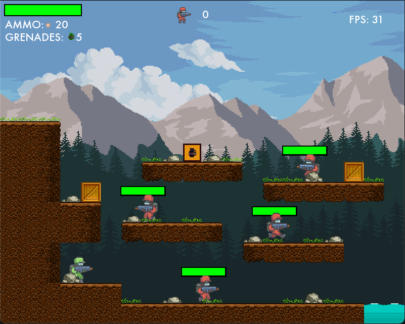
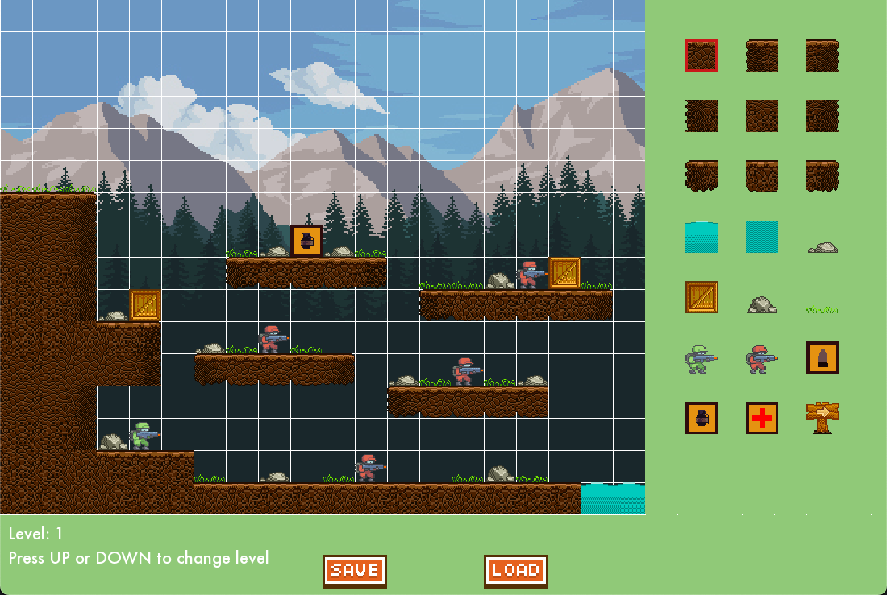

# PyShooter
> ⚠️ This game requires Python 3 or later


## About
A soldier is on a mission to capture the base of the enemy. As commanded by his Sergeant, he has to traverse and eliminate the enemy soldiers as much as he can and capture the bases. Each level is a base the soldier has to capture.

## Keyboard Controls
| Keybind 	    | Uses              	|
|---------	    |-------------------	|
| `W`       	| Jump              	|
| `A`       	| Move Backward     	|
| `D`       	| Move Forward      	|
| `Q`       	| Throw Grenade     	|
| `Space`   	| Shoot             	|
| `Esc`     	| Pause/Resume game 	|

## Running the game
```bash
# Windows
play.bat
# Mac
sh play.sh
```

# Level Editor


## Controls
| Keybind 	            | Uses              	|
|---------	            |-------------------	|
| `RightArrow`       	| Scroll Forward        |
| `LeftArrow`       	| Scroll Backward       |
| `MouseLeftClick`      | Select/Place Block    |
| `MouseRightClick`     | Remove Block          |

## Running the Editor
```bash
# Windows
editor.bat
# Mac
sh editor.sh
```